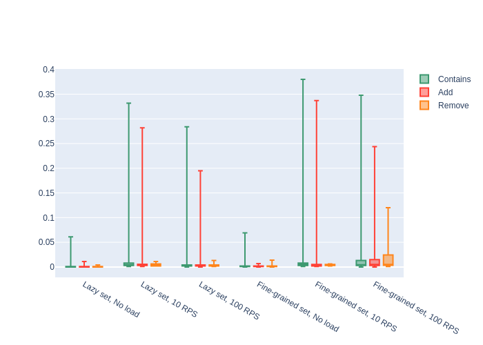

# ExamSystem problem

Implementation of the ExamSystem web API.

## Dependencies

- [.NET 7.0](https://dotnet.microsoft.com/en-us/download/dotnet/7.0)
- [Docker](https://www.docker.com/)

## Build and Run with dotnet

### Build project

```sh
dotnet build
```

### Run project

```sh
docker run --project ExamSystem <System type>
```

`<System type>` may be one of the following:

- fine-grained
- lazy

## Build and Run with Docker

### Build project

```sh
docker build -t examsystem:latest .
```

### Run project

```sh
docker run -p 8080:80 examsystem <System type>
```
`<System type>` may be one of the following:

- fine-grained
- lazy

## Web API usage

Add to system information that student with id=1 passed course with id=1 (ExamSystem **Add**):
```http request
POST http://localhost/api?studentId=1&courseId=1
```

Remove from system information that student with id=1 passed course with id=1 (ExamSystem **Remove**):
```http request
DELETE http://localhost/api?studentId=1&courseId=1
```
Check if student with id=1 passed course with id=1 (ExamSystem **Contains**):
```http request
GET http://localhost/api?studentId=1&courseId=1
```
Get number of records in system (ExamSystem **Count**):
```http request
GET http://localhost/api/count
```
## Load tests
Load test were run with [JMeter](https://jmeter.apache.org/). For each test system was initialized with the same 1000 records.

Test plans (`.jmx` files) can be found in `LoadTests` folder.

### Boxplots



### Max user count
Response timeout — 10 seconds, system initialized with 1000 records, test run time — 3 minutes.
Results:

- System with lazy set — 10200 users, ~40K records·
- System with fine-grained set — 3400 users, ~2,5K records·
