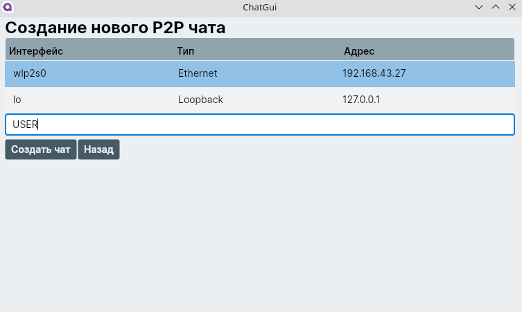
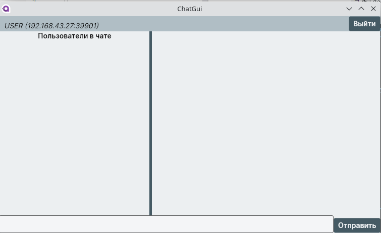
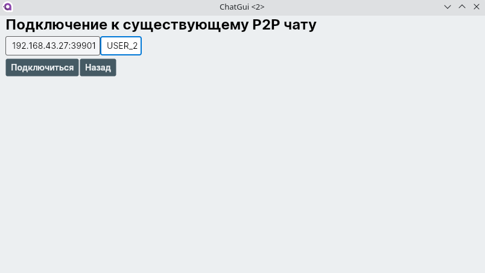
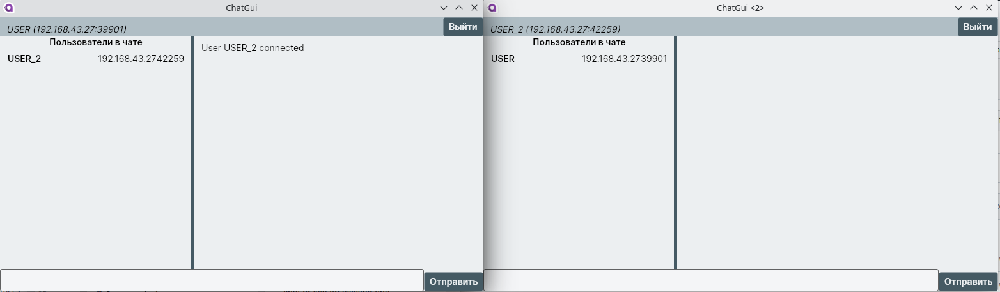
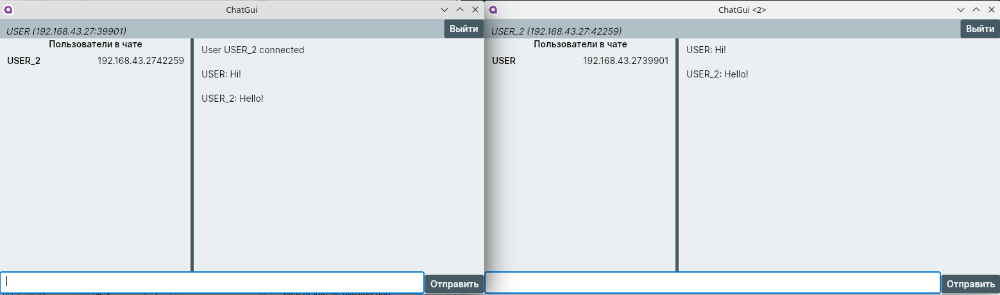
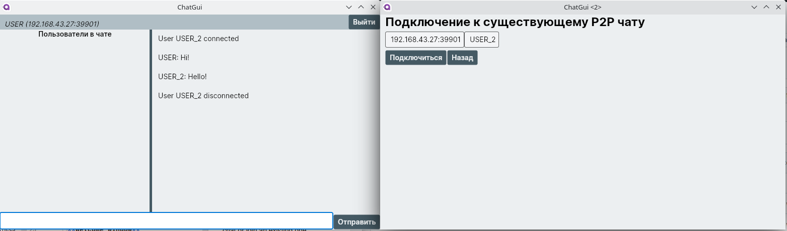
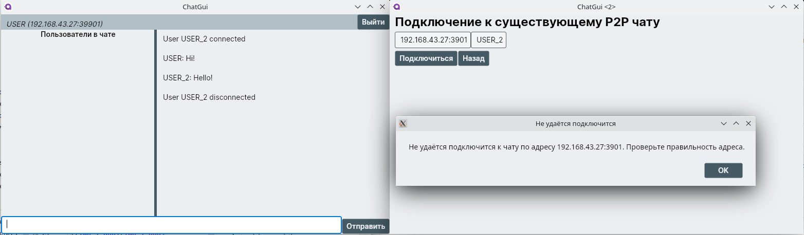

# P2P Chat

Peer-to-peer chat implementation.

## Dependencies

- [.NET 7.0](https://dotnet.microsoft.com/en-us/download/dotnet/7.0)

## Build and Run with dotnet

### Build project

```sh
dotnet build
```

### Run project

```sh
dotnet run --project ChatGui
```
### Run tests

```sh
dotnet test
```
## GUI
### Welcome window
User can choose whether to create a new chat or join an existing one.

### Chat creating window
User can choose available network interface and enter `Username`.
\
_**Created chat:**_

### Connect to existing chat window
User should enter connection address and `Username` that will be displayed.

_**Successful connection:**_

### Chat window
Each user has a list of chat members, list of chat messages and logout button to disconnect.\

**_Example of disconnection after `USER_2` logout:_**

**_Example of connection to wrong address:_**

