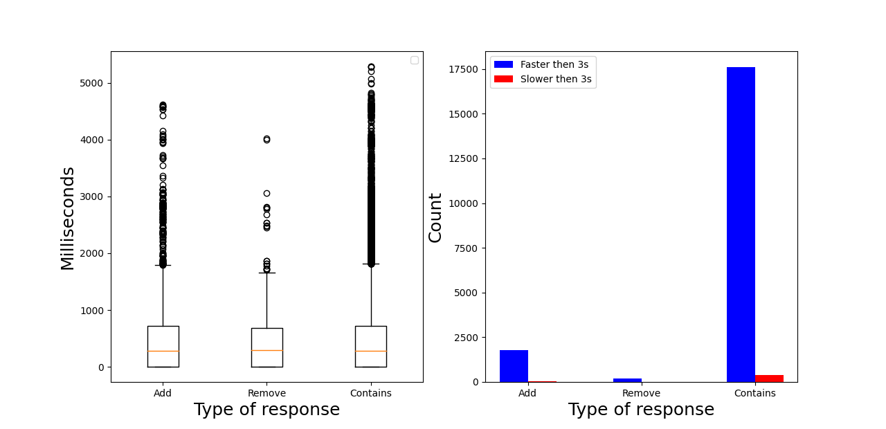

### Конфигурация нагрузочного тестирования
- Для OptimisticSet
- 4000 пользователей
- Каждый делает по 5 запросов
- Ramp-up period = 5 seconds
- Отказы обслуживания по тайм-ауту (больше 3 секунд) начиная с примерно 500 записей в множестве
<<<<<<< Updated upstream
- После тестирования остается примерно 1100 записей

#### Диаграммы распределения времени

#### Диаграмма количества пользователей

=======
- После тестирования остается примерно 1100 записей
>>>>>>> Stashed changes
