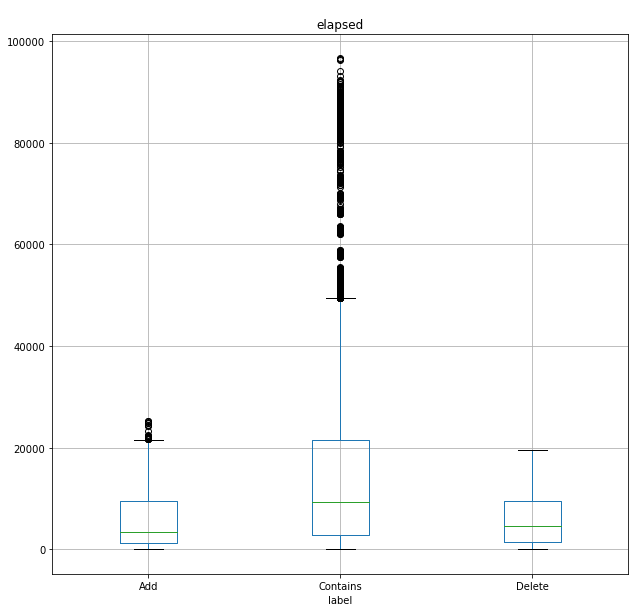

### CoarSet LoadTesting TimeOut + Add + Contains + Delete operations
- Number of users: 8000
- Each of users that make request: 10
- Number of request per minute: 30000
- 12612 records by timeout in 30 seconds
- Query Ratio Add:9%, Contains: 90%, Delete: 1%   
