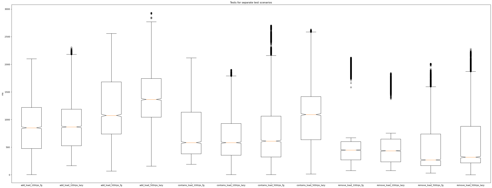
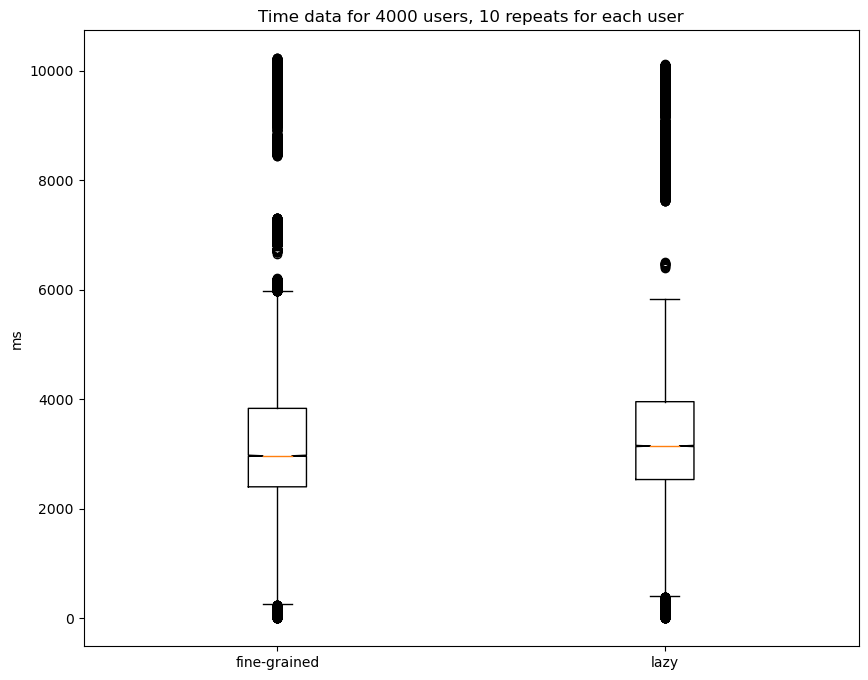
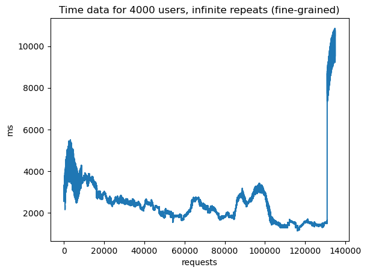
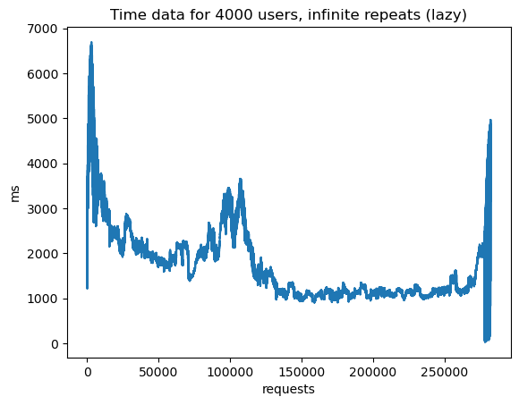

# Exam system

## Launch

with running docker daemon do:

```sh
./gradlew runDocker
```

or:

manual docker build&launch:
```sh
./gradlew buildImage
docker load < build/jib-image.tar
docker run -p 8080:8080 exam-system
```

## Usage

system supports two types of synchronization: <b>lazy</b> and <b>fine-grained</b>. To switch replace `<type>` in url requests with `lazy` or `fine-grained` 

### Request entries count:

```sh
curl http://localhost:8080/<type>/count
```

### Add new entry:

wrapping url in colons is advised, some shells treat `?` as a wildcard
```sh
curl -X POST "http://localhost:8080/<type>?studentId=2&courseId=0"
```

### Delete entry:

wrapping url in colons is advised, some shells treat `?` as a wildcard
```sh
curl -X DELETE "http://localhost:8080/<type>?studentId=2&courseId=0"
```
## Testing

Performance testing application: https://jmeter.apache.org

Tests configuration:
|                        | Contains, % | Add, % | Remove, % | Users count | Ramp-up time, s | Requests per user per test | Throughput, rps* | Sync type          |
|------------------------|-------------|--------|-----------|-------------|-----------------|----------------------------|------------------|--------------------|
| Contains requests only | 100         | 0      | 0         | 1000        | -               | 5                          | 100, 500         | lazy, fine-grained |
| Add requests only      | 0           | 100    | 0         | 1000        | -               | 5                          | 100, 500         | lazy, fine-grained |
| Remove requests only   | 0           | 0      | 100       | 1000        | -               | 5                          | 100, 500         | lazy, fine-grained |
| Load test              | 90          | 9      | 1         | 4000        | -               | inf                        | -                | lazy, fine-grained |
| Fail (timeout) test    | 90          | 9      | 1         | 4000        | 10              | inf                        | -                | lazy, fine-grained |

*rps stands for requests per second

### Separate requests

additional set-up (so the time data is distributed more evenly (add, contains); the system doesn't devolve into single lock sync (remove)):
- for each `add` and `contains` test 100 records were preemptively added to storage
- for each `remove` test 4900 records were preemptively added to storage



### Load testing

no additional set-up



### Failing point

#### Fine-grained
4000 clients: fails at ~10k records



#### Lazy
4000 clients: with timeout set at 4 seconds fails at ~4000 records, but then stabilizes at 1.5 s/response for a long time



(pike at the end is a testing framework artifact when jmeter is stopped, not meaningful)

## Code coverage

```sh
./gradlew koverReport && open ./build/reports/kover/html/index.html
```

## Tests summary

```sh
./gradlew koverReport && open ./build/reports/tests/test/index.html
```
