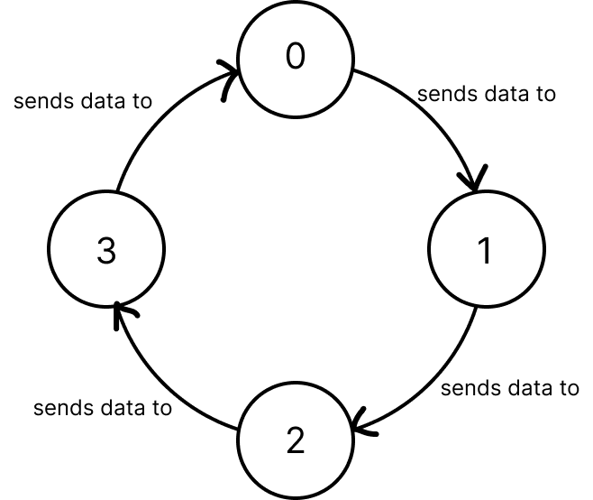

# Peer-to-peer socket chat

Chat is implemented using the ring topology, where each new chat user connects to the previous last (except for the first one)



[youtube demo](https://youtu.be/D1Td93AZP9s)

### Launch

to instantiate first chat client:
```sh
./gradlew run --args="<name> <port>"
```

to instantiate next clients:
```sh
./gradlew run --args="<name> <host_port> <prev_port>"
```

to stop execution simply close GUI

### Code coverage

```sh
./gradlew koverReport && open ./build/reports/kover/html/index.html
```

### Tests summary

```sh
./gradlew koverReport && open ./build/reports/tests/test/index.html
```
